  

 

> **The model isn't the bottleneck. The harness is.**

I build the unglamorous infrastructure around large language models — eval loops, tool governance, ratchets, HITL gates. The work that turns an LLM demo into a system you can run on a Tuesday and trust on a Friday.

 

### Field log

<table>
  <tr>
    <td width="120" valign="top"><b>NOW</b></td>
    <td>Shipping to <a href="https://github.com/Tracer-Cloud/opensre"><b>Tracer Cloud</b></a> — first PR (<a href="https://github.com/Tracer-Cloud/opensre/pull/1578">#1578</a>) merged in 2&nbsp;hours. Lining up the next one.</td>
  </tr>
  <tr>
    <td valign="top"><b>BUILDING</b></td>
    <td><b>Nawneetverse</b> — a 14-agent autonomous engineering loop. Daily runs. Self-scoring. Ratchets the floor.</td>
  </tr>
  <tr>
    <td valign="top"><b>THINKING</b></td>
    <td>About harness design. About when human-in-the-loop is a feature versus a leash. About how to make agents <i>boring</i>.</td>
  </tr>
</table>

 

### Cabinet

`Python` &nbsp;·&nbsp; `TypeScript` &nbsp;·&nbsp; `LangGraph` &nbsp;·&nbsp; `Agno` &nbsp;·&nbsp; `MCP` &nbsp;·&nbsp; `Claude` &nbsp;·&nbsp; `OpenAI` &nbsp;·&nbsp; `Playwright` &nbsp;·&nbsp; `Redis` &nbsp;·&nbsp; `PgVector` &nbsp;·&nbsp; `Docker`

 

### Telemetry

  

 

### Direct line

  <a href="https://www.linkedin.com/in/nawneet-kumar/"><b>LinkedIn</b></a> &nbsp;·&nbsp;
  <a href="mailto:nawneetkumar66@gmail.com"><b>Email</b></a>

Open source, harness design, or roles — drop a line. Faster signal: tag <code>@nawneet77</code> on any contribution above.

 

<code>// shipped, not demoed.</code>

